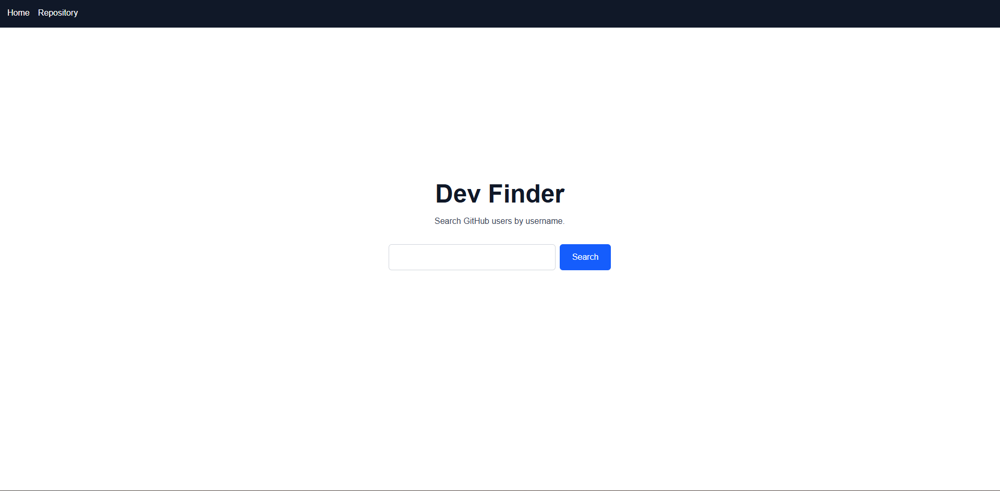
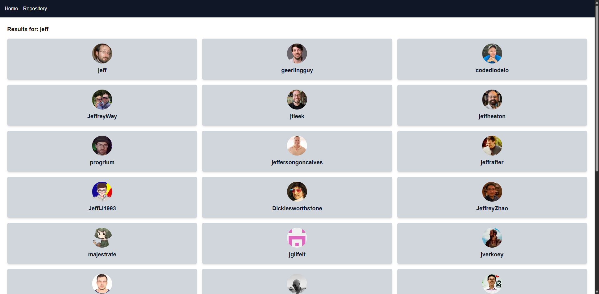

# Dev Finder

A web application for searching GitHub users and exploring their profiles and repositories.

🔗 **Live Demo:** https://dev-finder-cyan.vercel.app/



## Built with

- Next.js 15
- TypeScript
- Tailwind CSS
- GitHub API

## Features

- Search GitHub users by username
- View user profile — avatar, bio, followers, following, repositories count, location
- Browse user repositories with language and stars
- Dynamic routing for each user profile




## Getting Started

```bash
npm install
npm run dev
```
